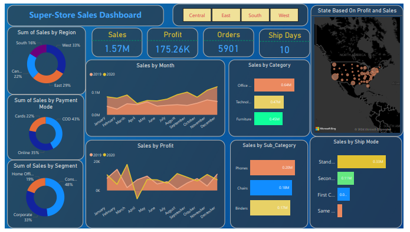
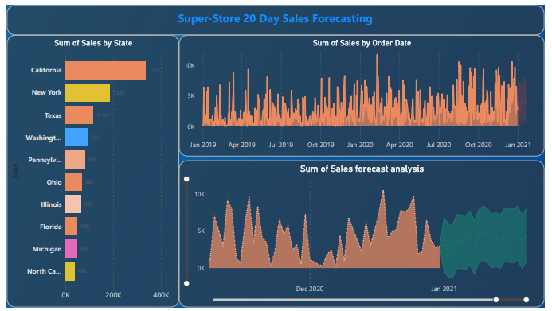

# Super-Store Sales Analysis – Power BI

This project provides a detailed analysis of Super-Store sales data using **Power BI**, offering actionable insights on sales performance, profitability, order trends, and forecasting. The interactive dashboard segments data by category, region, and customer behavior, helping businesses identify trends, improve strategies, and make data-driven decisions.

## Features

- **Sales Insights:** Analyze sales by category, sub-category, and shipping mode to identify top-performing products and delivery preferences.  
- **Regional Performance:** Review sales and profit across regions to prioritize underperforming areas.  
- **Customer Segmentation:** Segment customers into Consumer, Corporate, and Home Office groups to understand their contribution to sales and profit.  
- **Time-Based Trends:** Track monthly sales trends (2019–2020) and use 20-day sales forecasting to predict future performance.  
- **Profitability Analysis:** Break down profits by state and product category to optimize pricing, inventory, and stock management.  
- **Dashboard Tools:** Created an interactive dashboard using **Power BI Desktop** for easy decision-making.

---

---

## Key Learnings

This project demonstrates how to extract insights from retail sales data using analytical techniques and visualization tools. Key learnings include:

### Customer Behavior Analysis
- Consumer segment contributes **48% of total sales**, highlighting top-performing segments.  
- Popular product categories and sub-categories, such as **Phones, Chairs, and Binders**, show customer preferences and trends.

### Regional Insights
- California leads in sales ($335K), while the South and Central regions show lower contributions, indicating areas for strategic focus.

### Shipping and Payment Trends
- **Standard Class** shipping is the most preferred (33% of total orders).  
- **Cash on Delivery (COD)** is the most-used payment method, suggesting opportunities for card payment promotions.

### Seasonality and Trend Analysis
- Monthly sales trends highlight peak periods, supporting better inventory and workforce planning.  
- Time-series forecasting predicts future sales volume, aiding resource allocation and planning.

### Profitability Insights
- States like **California and New York** drive significant profits, while other regions underperform, indicating opportunities for targeted marketing and growth.

---

---

## Skills Demonstrated
- Data Cleaning & Transformation  
- Data Analysis  
- Customer & Regional Segmentation  
- Time-Series Forecasting  
- Data Visualization & Dashboard Design  
- Profitability & Sales Insights  
- Power Query  
- Power BI Desktop

## Outcome
This project provides a practical dashboard for retail management teams to monitor performance, understand customer behavior, forecast sales, and improve profitability. It demonstrates the use of Power BI for turning raw data into actionable business insights.

  
